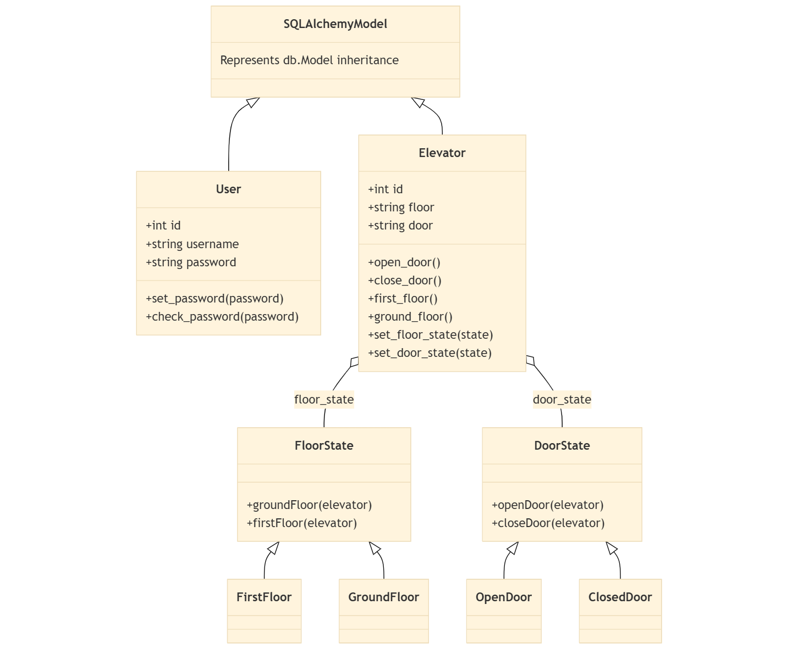

# State Example — Models and State Pattern

This repository demonstrates a small Flask application that uses SQLAlchemy for persisted models and the State Pattern for runtime behaviour. This README focuses on the model structure and how the state pattern is applied in this app.

## Class diagram
The class diagram (models.png) is embedded below. It shows which classes are persisted SQLAlchemy models and which are runtime-only state classes.



If your Git host does not render the image, open `models.png` directly in the repository.

## High-level overview
- Persisted models (SQLAlchemy): represent application data stored in the database. In this project these are:
  - `User` — App/models/user.py
  - `Elevator` — App/models/elevator.py

- Runtime-only state classes (State Pattern): encapsulate behaviour and transitions. These are *not* SQLAlchemy models and are only used at runtime:
  - Floor states: `FloorState` (abstract) -> `FirstFloor`, `GroundFloor` — App/models/state.py
  - Door states: `DoorState` (abstract) -> `OpenDoor`, `ClosedDoor` — App/models/state.py

## Persisted models (what's stored)
- Elevator (App/models/elevator.py)
  - Columns: `id`, `floor`, `door` (strings) — persisted values representing the last known state.
  - Methods: `set_floor_state(state)`, `set_door_state(state)` commit the state change to the database.
  - Behaviour: runtime `floor_state` and `door_state` attributes hold state objects, but persistence is performed by the setter methods which write `floor` and `door` columns and commit the session.

- User (App/models/user.py)
  - Typical user model persisted via SQLAlchemy (`db.Model`).

## Runtime state classes (State Pattern)
- The state classes implement behaviour and transitions. They are defined in `App/models/state.py` and do NOT inherit from `db.Model`.
- FloorState hierarchy
  - `FloorState` (abstract) defines the API: `groundFloor(elevator)` and `firstFloor(elevator)`.
  - `FirstFloor` and `GroundFloor` implement transitions. When moving between floors they:
    - Close the door (via elevator setter), change the floor state (via elevator setter), then open the door — using the Elevator's `set_*` methods to persist the change.

- DoorState hierarchy
  - `DoorState` (abstract) defines `openDoor(elevator)` and `closeDoor(elevator)`.
  - `OpenDoor` / `ClosedDoor` implement these actions and must use `elevator.set_door_state(...)` so that the persisted `door` column is updated.

Why this split matters
- Persistence vs behaviour: the database stores simple identifiers (`floor`, `door`) so the persisted state is compact and queryable. The more complex runtime behaviour (what happens when you move floors or open/close doors) lives in state objects following the State Pattern. This keeps concerns separated and makes behaviour easy to test and extend.

## Where to look in code
- `App/models/user.py` — `User(db.Model)` persisted model.
- `App/models/elevator.py` — `Elevator(db.Model)` persisted model with setters (`set_floor_state`, `set_door_state`) that persist changes.
- `App/models/state.py` — state pattern implementation (FloorState, DoorState and their concrete subclasses).
- `wsgi.py` — includes a `flask` CLI command `flask elevator` which lets you select an elevator row and operate it using the state objects (open/close/first_floor/ground_floor). The CLI rehydrates runtime state objects from persisted columns and uses the model setters for changes.

## Quick usage (CLI)
From the project root, with your virtualenv active and configuration set (see your `.flaskenv`):

1. Initialize the database and seed elevators (this project provides an `init` command):

```cmd
set FLASK_APP=wsgi
flask init
```

2. Start the elevator CLI and select an elevator id:

```cmd
flask elevator
```

3. Commands you can run inside the CLI: `open`, `close`, `first_floor`, `ground_floor`, `switch`, `help`, `quit`.

Each operation uses the state objects and the Elevator's setter methods so the `floor` and `door` columns are kept in sync with runtime behaviour.

## Notes and best practices
- Always use `Elevator.set_floor_state()` and `Elevator.set_door_state()` to change states so changes are persisted correctly.
- State classes should not perform direct attribute assignment to persisted fields; they should call the model setters.
- The persisted string values in `floor` and `door` are the authoritative DB values and are used to rehydrate runtime state when the CLI selects an elevator.

## Focused documentation
This README intentionally focuses on the models and state pattern. Sections covering configuration management, tests, deployment, and troubleshooting from the original template were removed to keep the documentation focused.

If you want, I can:
- Add a short `docs/models-diagram.md` file containing the Mermaid diagram and link it here, or
- Export `models.png` to a different format or regenerate it from a Mermaid source. Which would you prefer?
